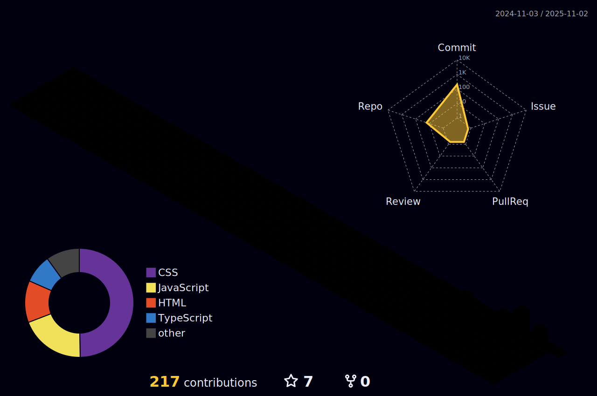

Hi 👋! My name is Mateus Hoffmann de Lima and I'm a Frontend Developer, from Passo Fundo, Brazil.

  <table>
    <tr>
      <td><b>⭐ Total Stars Earned:</b></td>
      <td><!--STARS_START-->0<!--STARS_END--></td>
    </tr>
    <tr>
      <td><b>🔁 Total Commits:</b></td>
      <td><!--COMMITS_START-->152<!--COMMITS_END--></td>
    </tr>
    <tr>
      <td><b>🔀 Total PRs:</b></td>
      <td><!--PRS_START-->0<!--PRS_END--></td>
    </tr>
    <tr>
      <td><b>❓ Total Issues:</b></td>
      <td><!--ISSUES_START-->0<!--ISSUES_END--></td>
    </tr>
    <tr>
      <td><b>📦 Contributed to (last year):</b></td>
      <td><!--REPOS_START-->178<!--REPOS_END--></td>
    </tr>
  </table>

  
  

  
  
  
  
  
  
  
  
  
  
  

  
  

 

